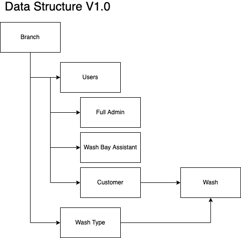

# Car Wash App

## Project setup

```bash
git clone git@github.com:MMMikeM/car-wash-app.git
cd car-wash-app
make setup
```

### Running the application
```bash
make run
```

### Stopping the application
```bash
make stop
```

## Data Structure


Please check the other the Makefile for other commands
